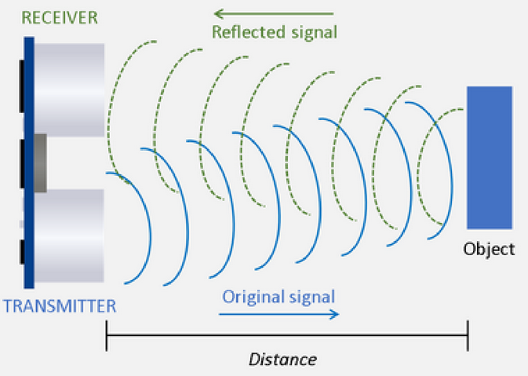
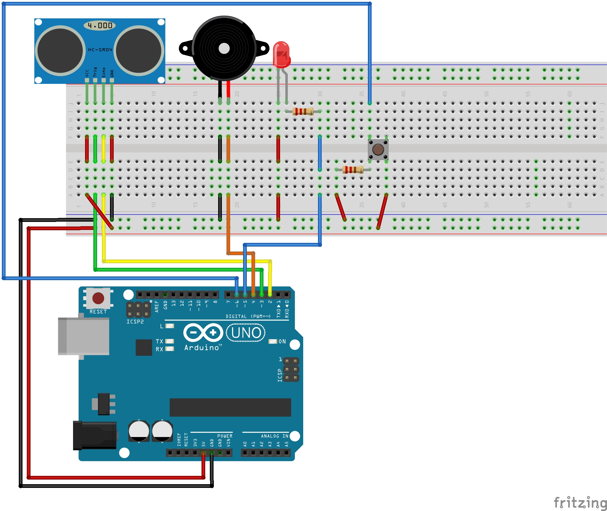

<div align="center">
   <h1>
      Do Not Enter My Room
   </h1>
   <p align="center">
      You guessed it, I got bored again so I made a shitty alarm using my Arduino UNO.
   </p>
   
</div>

## How it works

For this project you need these parts:

- 1x Arduino UNO
- 1x HC-SR04 Ultrasonic Sensor
- 1x Buzzer
- 1x LED (Red)
- 1x button (with 4 pins)
- 2x resistor 220 Ω



The `HC-SR04` is a ultrasonic sensor which works as following.

1. The transmitter (`trig` pin) transmits sound waves at a frequency of 40 KHz.
2. When a object is in front of these waves, the waves will reflect back.
3. The receiver (`echo` pin) will receive the reflected waves and send out a electrical signal.

Using this technique, we can determine the distance between the object and the sensor by applying some basic math.
If we know that the distance between the sensor and the object is one-half the distance traveled by the sound wave (approximately 343m/s) .
This translates in the following formula: `distance = (traveltime/2) x speed of sound`.
Keep in mind that we need to divide by 2 because the wave was sent, hit a object and got returned to the sensor.
By using this formula we can let the Arduino calculate the distance in centimeters and print the value out to the serial monitor.
This is basically the foundation upon which the alarm is built.

When the sensor detects that an object is between 2cm and 17cm, the Arduino will play a sound by triggering a buzzer.
A LED (Light Emitting Diode) will also start blinking.
To stop the beep and LED from blinking simply remove the object.
You can toggle the alarm on and off by pressing the button.

To compile and upload the code to the Arduino you can do the following.

**NOTE**: The commands below assume you are using an Arduino UNO. Refer to the [docs](https://arduino.github.io/arduino-cli/0.27/getting-started/) for more information.

```
$ cd src/                                                                  # Navigate inside the source directory
$ arduino-cli compile --fqbn arduino:avr:uno alarm                         # Compile the code
$ arduino-cli upload -p /dev/ttyACM0 --fqbn arduino:avr:uno alarm          # Upload the compiled code to the Arduino UNO
```

Because I didn't want to build a standard the alarm that you would make with a Arduino, we will also make it so when it detects an object it will send a notification via Discord.
Since I don't have the hardware to get the Arduino to send the notification, we'll use python instead.
To do this we need some way of letting the computer know when the alarm is triggered, so let's read the input from the serial monitor and wait for a trigger (`Alarm triggered!`).
Just like my other project [wittimr](https://github.com/AntonVanAssche/wittimr) (What Is The Temperature In My Room) we will read the serial output from this file `/dev/ttyACM0`.
But first we need to update the permissions (`crw-rw-rw-`) to do this, enter the command below in your terminal.
We will have to do this everytime we disconnect and reconnect the Arduino to the computer.

```bash
$ sudo chmod a+rw /dev/ttyACM0
```

Now that we are able to read the serial output using Python it's time to setup the notifications.
When we detect the line `Alarm triggered!`, we want to send the notification.
To send the notification we will use a Discord server Webhook.

```
$ python3 notification.py
```

Because we want to send a notification when the alarm is triggered, a computer must be continuously connected to the Arduino.
If we do not connect a computer, the alarm itself will still work but no notification will be sent.

## Electrical scheme



## References

- [Arduino – Read Serial Communication with Raspberry Pi](https://www.elithecomputerguy.com/2020/12/arduino-read-serial-communication-with-raspberry-pi/) by Eli the Computer Guy
- [Create A Discord Webhook in Python for a bot](https://www.codespeedy.com/create-a-discord-webhook-in-python-for-a-bot/) by Monish C
- [Arduino CLI Getting started](https://arduino.github.io/arduino-cli/0.27/getting-started/)

